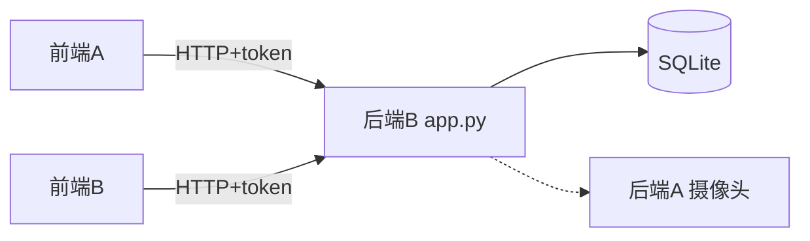

# 后端 B 任务指南

> Python + SQLite 轻量版，不用装 JDK / Maven / SQL Server。

## 一键启动

```bash
cd d:\hym\backend-b
pip install -r requirements.txt
python app.py
```

启动后访问：`http://localhost:8080/api`

## 测试账号

| 角色 | 用户名 | 密码 |
|------|--------|------|
| 普通用户 | test01 | 123456 |
| 管理员 | admin01 | 123456 |

## 项目文件说明

| 文件/目录 | 说明 |
|-----------|------|
| `app.py` | 后端主程序 |
| `data/tree_adoption.db` | SQLite 数据库（首次启动自动创建） |
| `sql/建表.sql` | DBA 给的 SQL Server 建表脚本 |
| `sql/一键初始化.sql` | SQL Server 建库+建表+测试数据 |
| `sql/测试数据.sql` | 仅测试数据 |
| `docs/农业树木认养系统.docx` | 对外 API 接口文档 |
| `docs/后端A接口文档.md` | 后端 A 摄像头内部接口 |
| `docs/接口测试页面.html` | 后端 A 联调测试页 |
| `API测试.http` | 后端 B 接口测试 |

## 已实现接口

```
POST /api/user/register      POST /api/user/login       GET  /api/user/info
GET  /api/tree/list          GET  /api/tree/detail      POST /api/tree/add
PUT  /api/tree/update        DELETE /api/tree/remove
POST /api/order/create       GET  /api/order/myTree     GET  /api/order/all
GET  /api/camera/snapshot    GET  /api/camera/rtsp      GET  /api/camera/status/list
POST /api/camera/manualCap
GET  /api/company/list       POST /api/company/add      PUT  /api/company/update
DELETE /api/company/remove   GET  /api/maintenance/list POST /api/maintenance/add
```

## 摄像头模式

默认 **mock**，返回占位图。

接真实后端 A：

```powershell
$env:HARDWARE_MOCK="false"
python app.py
```

## 和后端 A 联调

1. 浏览器打开 `docs/接口测试页面.html` 测后端 A
2. 后端 A 通了之后，设 `HARDWARE_MOCK=false` 重启
3. 测 `GET /api/camera/snapshot?treeId=1`（treeId=1 绑定 GU0249887）

## 给前端联调

```
基础地址：http://localhost:8080/api
用户账号：test01 / 123456
管理员：admin01 / 123456
登录后请求头：token: xxx
```

## PPT 架构图


